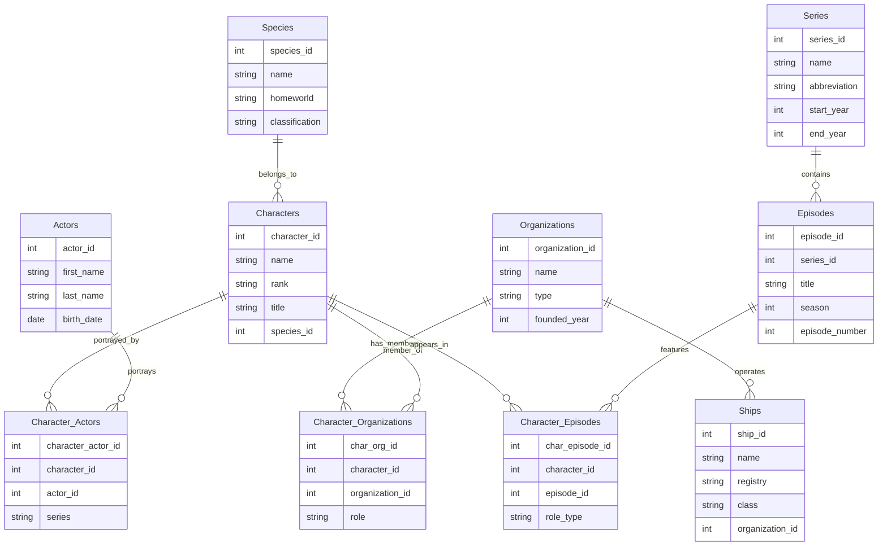

# Star Trek Database - Entity Relationship Diagram

## Relationship Summary

### One-to-Many Relationships
- **Species → Characters**: One species has many characters
- **Organizations → Ships**: One organization operates many ships
- **Series → Episodes**: One series contains many episodes

### Many-to-Many Relationships
- **Characters ↔ Actors**: Characters portrayed by multiple actors; actors play multiple characters
- **Characters ↔ Organizations**: Characters belong to multiple organizations; organizations have multiple members
- **Characters ↔ Episodes**: Characters appear in multiple episodes; episodes feature multiple characters

### Key Insights
- Junction tables: `Character_Actors`, `Character_Organizations`, `Character_Episodes`
- All tables include timestamp tracking (`created_at`, `updated_at`)
- Foreign keys maintain referential integrity
- Unique constraints prevent duplicates in junction tables
